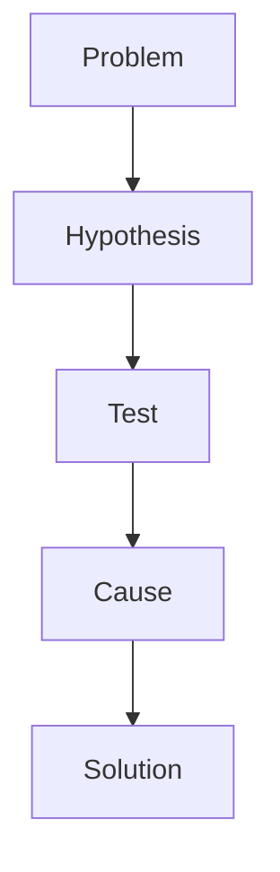

# xoals3094.github.io

Personal technical blog.

Backend / Database / Operating System / CS 학습과 문제 해결 기록.

## Writing on Tablet

1. Android Chrome에서 [Repository](https://github.com/xoals3094/xoals3094.github.io)를 열고 GitHub에 로그인한다.
2. [github.dev 열기](https://github.dev/xoals3094/xoals3094.github.io)를 누른다. 주소의 `github.com`을 `github.dev`로 바꿔도 된다. 키보드 단축키는 필요 없다.
3. Explorer에서 `templates`의 원하는 템플릿을 열어 전체 내용을 복사한다.
4. `_posts` 폴더를 선택하고 New File로 `YYYY-MM-DD-title.md` 파일을 만든다. 예: `_posts/2026-09-06-index-access-condition.md`.
5. 붙여넣고 제목, 날짜, 카테고리, 태그와 본문을 작성한다. 템플릿 원본은 그대로 둔다.
6. `main` 브랜치인지 확인하고 Source Control에서 변경 파일 옆 `+`로 Stage한 뒤 메시지를 입력하고 **Commit & Push**한다. Commit만 표시되는 경우 Push/Sync까지 완료해 GitHub에 반영한다.
7. Repository의 Actions에서 **Build and Deploy** 성공을 확인하고 [블로그](https://xoals3094.github.io)를 연다.

Ruby 설치, 터미널, Git CLI, SSH, PC는 일반 글 작성에 필요하지 않다. 화면이 좁으면 Chrome의 **데스크톱 사이트**를 켜거나 Explorer를 접는다. github.dev의 Markdown Preview는 본문 확인용이며 실제 Chirpy 화면은 배포 후 확인한다.

## Create Post

파일은 `_posts` 바로 아래에 만든다. 카테고리별 하위 폴더는 만들지 않는다.

```yaml
---
title: "인덱스 컬럼이 Filter 조건으로 처리되는 이유"
date: 2026-09-06
categories: [Database, SQL Tuning]
tags: [oracle, index]
---
```

파일명과 `date`는 같은 날짜로 작성한다. 복사한 템플릿의 빈 `title`, `date`를 채운다. 시간대는 `Asia/Seoul`이다. 미래 날짜의 글은 빌드 시점에 공개되지 않으며 날짜가 지나도 자동 재빌드되지 않는다. 미완성 글은 `_posts` 대신 `_drafts/title.md`에 보관할 수 있다.

- [문제 해결 템플릿](templates/problem-solving.md): 문제 → 예상 → 확인 → 원인 → 해결 → 원리
- [학습 템플릿](templates/study.md): 문제의식 → 개념 → 예제 → 검증
- [프로젝트 의사결정 템플릿](templates/project-decision.md): 선택지 → 선택 이유 → Trade-off → 결과

카테고리는 실제 글을 쓸 때만 생성된다. 필요한 경우 아래에서 상위 분류와 하위 분류 하나를 선택한다.

| 상위 분류 | 하위 분류 후보 |
| --- | --- |
| Database | SQL Tuning, Oracle, SQLP |
| Operating System | Nand2Tetris, Pintos, OS Development |
| Backend | Python, Server, Troubleshooting |
| Projects | Design, Troubleshooting, Retrospective |
| Computer Science | Network, Data Structure, Etc |

태그는 `oracle`, `index`처럼 소문자로 유지한다. 관련 구현은 `[관련 코드](https://github.com/xoals3094/REPOSITORY)` 형태로 실제 저장소에 연결한다.

코드는 fenced code block의 언어를 지정한다: `sql`, `python`, `java`, `c`, `cpp`, `shell`, `xml`, `json`, `yaml`.

````markdown
```sql
SELECT * FROM employees WHERE employee_id = 100;
```
````

Mermaid는 필요한 글의 Front Matter에만 `mermaid: true`를 추가한다.

````markdown

````

목차는 본문의 `##`, `###` 제목으로 만들어진다. `author`, `description`, `image`, `pin`, `math`, `mermaid`, `toc`, `comments`는 필수가 아니다. 이미지가 필요하면 `assets/img/posts/`에 업로드하고 ``으로 참조한다.

## Local Development

PC에서 테마 수정이나 오류를 확인할 때만 Ruby 3.4와 Bundler를 준비한다.

```sh
bundle install
bundle exec jekyll serve
```

접속: <http://localhost:4000>

배포와 같은 빌드 및 내부 링크 검사:

```sh
JEKYLL_ENV=production bundle exec jekyll build
bundle exec htmlproofer _site --disable-external
```

## Deploy

Commit & Push → GitHub Actions → Jekyll Build / 내부 링크 검사 → GitHub Pages

초기 설정은 한 번만 필요하다.

1. GitHub 계정 `xoals3094`에 공개 저장소 `xoals3094.github.io`를 준비한다. 기존 저장소가 있으면 내용을 먼저 확인한다.
2. 이 프로젝트의 파일을 숨김 폴더 `.github`까지 포함해 `main` 브랜치에 반영한다.
3. **Settings → Pages → Build and deployment → Source → GitHub Actions**를 선택한다.
4. **Actions → Build and Deploy → Run workflow**로 최초 배포한다. 이후 `main` 또는 `master`에 글을 Push하면 자동 실행된다.
5. 성공 후 <https://xoals3094.github.io>를 확인한다.

배포에 개인 토큰이나 별도 비밀값은 필요하지 않다. 워크플로의 `GITHUB_TOKEN`과 Pages OIDC 권한을 사용한다. 배포 실패 시 Actions에서 Build site / Test site / Deploy 로그를 확인한다. 제목 따옴표, 빈 날짜, 이미지 경로를 먼저 확인한다.

## Validation

초기 배포 후 Android Chrome에서 다음 흐름으로 점검한다.

- Home, About, 첫 글, Categories, Tags가 열리는지 확인한다.
- 검색에 `블로그`를 입력해 첫 글을 찾고, 본문 목차와 Dark Mode를 확인한다.
- 태블릿에서 템플릿을 복사해 실제 글을 만들고 Commit & Push한 뒤 Actions 성공과 공개 여부를 확인한다.
- 글이 두 개 이상이면 Previous / Next를 확인한다.
- 코드가 포함된 글에서 구문 강조, 긴 코드의 가로 스크롤, Mermaid를 확인한다.
- 세로/가로 화면에서 메뉴, 검색, 본문 읽기를 확인한다.

구성 시 로컬 검증 결과 (2026-09-06):

- Ruby 3.4.4 / Jekyll 4.4.1 / Chirpy 7.6.0 프로덕션 빌드 성공.
- HTML-Proofer: 공개 페이지 9개, 내부 링크 18개 검사 통과.
- 저장소 밖 임시 글로 SQL, Python, Java, C, C++, Shell, XML, JSON, YAML의 강조 토큰 생성 확인.
- 임시 글로 2단계 카테고리, 태그, 검색 JSON, 이전/다음 링크 및 Mermaid의 글별 스크립트 로딩 확인.
- 목차·모드 전환 컨트롤과 반응형 viewport 마크업 확인. `templates`가 출력되지 않는 것 확인.

브라우저에서 검색·목차·모드 전환·Mermaid 렌더링을 직접 조작하는 검증, 실제 GitHub Actions 실행 및 Android 기기 검증은 아직 수행하지 않았다. 원격 저장소 조회는 인증 오류로 실패했으므로 원격 저장소 생성·업로드·Pages 활성화는 별도로 필요하다. 선택적 PC 글 생성 스크립트는 실제 배포 검증 이후로 보류했다.

## Maintenance

[공식 Chirpy Starter](https://github.com/cotes2020/chirpy-starter)의 구조와 Gemfile을 사용한다. 기반 커밋: `beffc88713242da8bf49325674be38d171071213`. 테마는 `jekyll-theme-chirpy ~> 7.6`으로 가져오며 레이아웃과 JavaScript는 재구현하지 않는다. 업데이트 시 Starter의 `_config.yml`, Gemfile, 워크플로 변경을 비교한다.

이메일, 실제 이름, avatar, Custom Domain, Analytics, 댓글 계정은 설정하지 않았다. 필요할 때만 `_config.yml`에서 추가한다. favicon은 Chirpy 기본값을 사용한다. `templates`는 작성용이며 공개 사이트에서 제외한다.

참고: [Chirpy 설치](https://chirpy.cotes.page/posts/getting-started/), [글 작성](https://chirpy.cotes.page/posts/write-a-new-post/), [github.dev 사용법](https://docs.github.com/en/codespaces/the-githubdev-web-based-editor).
